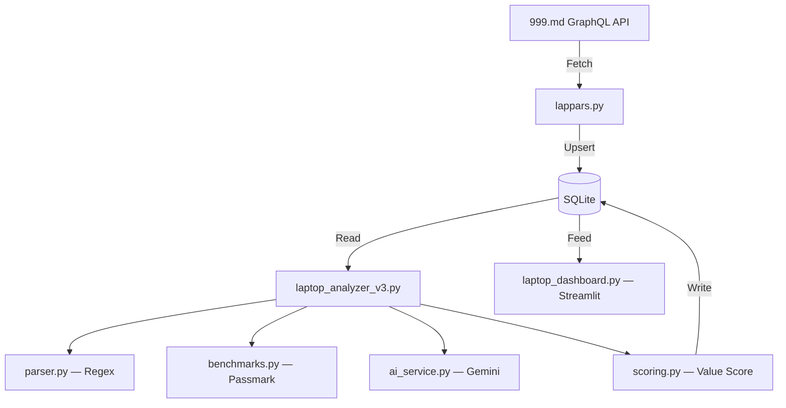

# 💻 NotebookBuy

[](https://www.python.org/downloads/)
[](LICENSE)
[](https://github.com/pravel-no/notebookbuy/actions/workflows/ci.yml)

**Find the best laptop deals on [999.md](https://999.md)** — scrape listings via GraphQL, score hardware with Passmark benchmarks, and explore results in a premium Streamlit dashboard.

> **Disclaimer:** NotebookBuy is not affiliated with 999.md. Use respectful request rates and comply with the site's terms of service. Scraping is for personal research only.

---

## ✨ Features

| Feature | Description |
|---------|-------------|
| **GraphQL Scraper** | Direct API queries — no HTML parsing overhead |
| **Hardware Scoring** | Passmark CPU + GPU fuzzy-match benchmarks |
| **AI Spec Extraction** | Gemini-powered fallback when regex can't parse the ad |
| **Dynamic FX Rates** | USD/EUR → MDL rates auto-fetched & cached for 24 h |
| **Price Tracking** | Every price change is recorded; history visualized per ad |
| **Premium Dashboard** | Dark-themed Streamlit UI with scatter plots, filters, and CSV/JSON export |

---

## 🏗️ Architecture



## 📂 Project Structure

```
notebookbuy/
├── lappars.py              # 999.md GraphQL scraper + price tracker
├── laptop_analyzer_v3.py   # Spec extraction + benchmark scoring pipeline
├── laptop_dashboard.py     # Streamlit analytics dashboard
├── parser.py               # Precompiled regex for CPU/GPU/RAM/SSD
├── benchmarks.py           # Passmark data fetch, cache, and fuzzy search
├── scoring.py              # Value-score formula + laptop classification
├── ai_service.py           # Gemini AI structured extraction
├── currency.py             # Dynamic exchange rate fetching
├── db.py                   # SQLite schema, migrations, context manager
├── app_config.py           # Env-based runtime configuration
├── retry_utils.py          # Exponential backoff retry helper
├── launcher.py             # PyInstaller .exe entry point
├── query_999.graphql       # GraphQL query for 999.md ads
├── pyproject.toml          # Project metadata, dependencies, ruff, pytest
├── .env.example            # Template for environment variables
├── tests/
│   ├── test_parser.py      # Regex extraction tests
│   ├── test_scoring.py     # Scoring & classification tests
│   ├── test_currency.py    # Exchange rate fallback tests
│   └── test_db.py          # Schema creation & migration tests
└── .github/workflows/
    └── ci.yml              # Lint + test on every push / PR
```

---

## ⚡ Quick Start

### 1. Install

```bash
git clone https://github.com/pravel-no/notebookbuy.git
cd notebookbuy
python -m venv .venv
```

Activate the virtual environment:

- **Windows:** `.venv\Scripts\activate`
- **macOS / Linux:** `source .venv/bin/activate`

Then install dependencies:

```bash
pip install -e ".[dev]"
```

### 2. Configure

```bash
cp .env.example .env   # Windows: copy .env.example .env
```

`GEMINI_API_KEY` is **optional**. Without it, the pipeline uses regex parsing and Passmark benchmarks (Passmark data is downloaded on first analyzer run). Add a key only if you want AI fallback for unclear ads or world-price lookups.

### 3. Run

```bash
# Fetch latest ads
python lappars.py --once

# Analyze & score
python laptop_analyzer_v3.py

# Launch dashboard
streamlit run laptop_dashboard.py
```

---

## 🧮 How Scoring Works

Each laptop gets a **Value Score** = performance-per-MDL index.

```
tech_pts = (CPU_bench × 0.55 + GPU_bench × 0.35 + (RAM×150 + SSD_bonus) × 0.10)
         × RAM_multiplier × age_penalty × broken_penalty

value_score = tech_pts / price × 100
```

- **CPU / GPU benchmarks** — looked up from [Passmark](https://www.cpubenchmark.net/) via fuzzy name matching.
- **Age penalty** — 8 % per year from current; floors at 0.20.
- **Broken penalty** — ×0.1 if the ad is marked as spare parts.
- Higher **value_score** → better deal.

---

## 🧪 Testing

```bash
pytest -v
```

---

## 🔧 Linting

```bash
ruff check .
```

Configuration is in `pyproject.toml`.

---

## 📦 Building an .exe

```bash
pyinstaller laptop_finder.spec
```

The standalone executable will be in `dist/`.

---

## 🤝 Contributing

See [CONTRIBUTING.md](CONTRIBUTING.md) for development setup, code style, and PR guidelines.

---

## 📄 License

[MIT](LICENSE)
